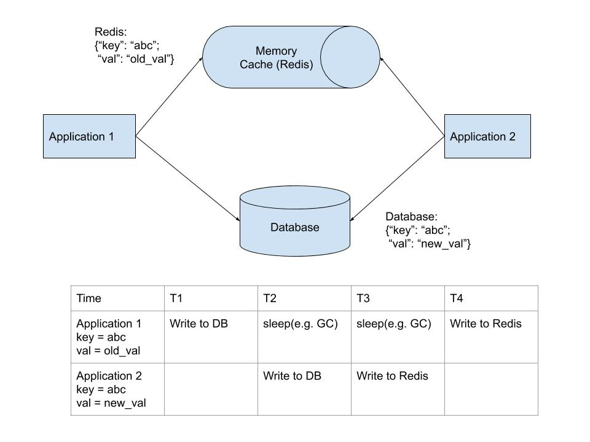

# What is Redisoo?

Redisoo pronouces /rediso͞o/, meaning **Redis + Through**.

In short, Redisoo makes Redis connect to backend database directly, 

including MySQL, PostegreSQL, Oracle, ODBC(SQL Server), SqlLite, DB2, Firbird and gRPC.

NOTE: For gRPC, you need code your gRPC server as middle tier to the backend database.

It makes Redis **Cache Through** to solve some problems which are described in details below.

# Cache Through vs Cache Aside

We usually use Redis as cache for other backend database like MySQL, PostegreSQL, SQL Server. 

Redis only supports **Cache Aside** pattern, 

which means applications need to deal with Redis and database at the same time.

e.g.

When applications read a key/value, they first try to read it from Redis. 

If Redis responses that the key is not in its memory, 

applications need to connect to backend database and **SELECT** the key/value from db. 

Then applications need to write the key/value to Redis by using Redis set or setex command

so next time applications can get the same key/value from Redis memory.

When applications write the new value of the key, 

they need to write the key/value to backend database and Redis (or just simply delete the key from Redis).

Cache can be applied as **Cache Through** pattern, 

which means cache can connect to database directly and **SELECT** key/value for applications

so applications only deal with cache and have no idea about backend database.

Unfortunately Redis does not support **Cache Through** pattern. 

But Redisoo can do it and support all Redis features.

[You can check this artile for the comparsion](https://codeahoy.com/2017/08/11/caching-strategies-and-how-to-choose-the-right-one/)

# The problems and the benefits

## Consistency Problem

In "Cache Aside" pattern, there is an inconsistency problem.

NOTE: if you can not see the picture below, mostly in China, please do the fix

sudo vi /etc/hosts
add a line of: ```199.232.68.133 raw.githubusercontent.com```



In "Cache Through" pattern, Redisoo solves the inconsistent problem.

## Duplication Problem

In the above diagram, supposing that application 1 & 2 get the same key from Redis concurrently.

if the key is not in Redis, they both get the value from database, then write to Redis. 

The second read from database is duplicated, and can not be avoided in Cache Aside pattern. 

The same thing can happen with a duplicated write to database in similar scenario.  

In peak time, the fan-out number could be hundreds or thousands depending on how many applications you have.

Redisoo can solve the duplicated action problem. 

In Redisoo, only **ONE** read/from (or write/to) database is needed with thousands concurrent applications. 

## One code component

In Cache Aside pattern, applications need have various components for the same logic.

e.g. 

If you have Python/Java/Php/C++ applications, you need code the same logic for all kinds of language.

Even in one programming language, if the abstraction or the common library is not good enough, 

you need write different code for the same logic like 'SELECT/INSERT/UPDATE/DELETE'.

Redisoo can save the code because **NO SQL anymore**.

## NO SQL anymore

This time, Redisoo can simplify the code because all applications only need the basic operations, 

**GET/SET/DEL** to Redis, 

No SELECT/UPDATE/INSERT/DELETE SQL statements for any database. 

No JDBC, No Python Database module, No C/C++ database library.

Applications only need to use Redis client module/library, and do simple 'GET/SET/DEL' commands of Redis.

The applications only see Redis and only interact with Redis. 

Redisoo deals with database directly for applications, or through gRPC to deal with the backend database.

# How build and how use

[How Build](doc/build.md)

[How Use](doc/use.md)


