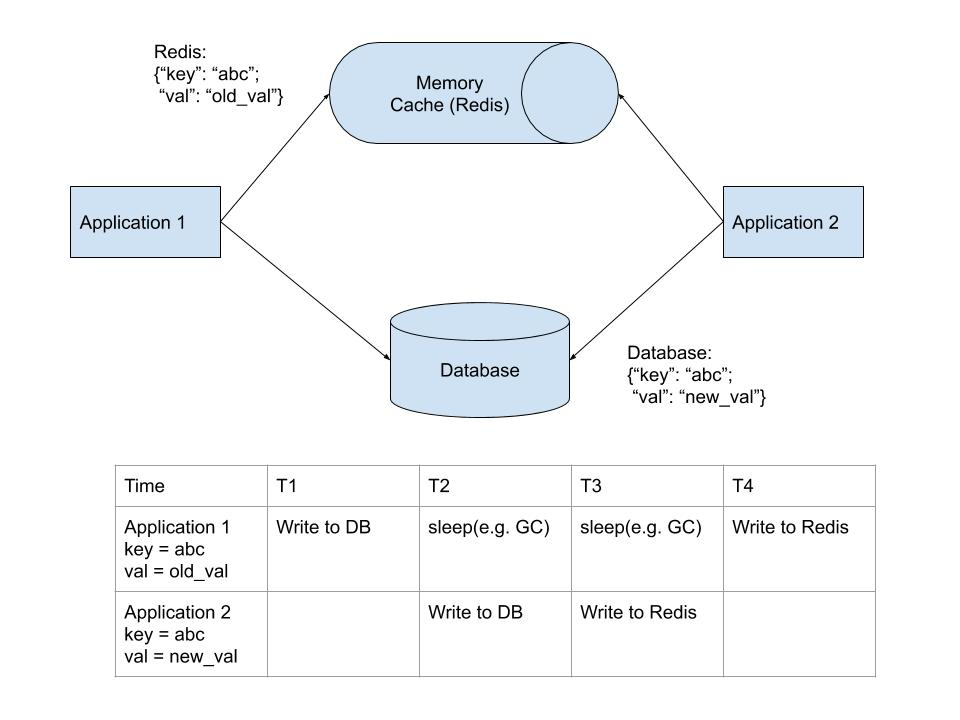

# What is Redisoo?

Redisoo pronouces /rediso͞o/, means **Redis + Through**.

In short, Redisoo makes Redis directly connect to the backend database, 

including MySQL, PostegreSQL, Oracle, ODBC(SQL Server), SqlLite, DB2, Firbird.

It makes Redis the 'Cache Through' pattern to solve some problems.

# Cache Through vs Cache Aside

We usually use Redis as cache for database. 

But always applications use Redis as **Cache Aside** pattern, which means they need deal with Redis and database at the same time.

E.g.

When applications read a key/value, they first try to read it from Redis. 

If Redis responses that the key is not there, applications need to connect to database and **SELECT** the key/value from db. 

Then applications need to write the key/value to Redis (by using Redis set command) 

because next time Redis will response them the key/value is there in Redis memory. 

Cache can be used as **Cache Through** pattern, which means cache can connect to database and **SELECT** key/value for applications.

But Redis does not support **Cache Through** pattern. That is why Redisoo is here.

[You can check this artile for the comparsion](https://codeahoy.com/2017/08/11/caching-strategies-and-how-to-choose-the-right-one/)

# The problems Redisoo solves and the benefits Redisoo brings

## Consistency

In "Cache Aside" pattern, there is an inconsistency problem.

In "Cache Through" pattern, Redisoo solves the inconsistent problem.

## Avoiding duplicated Read/Write to database, especially for peak time

In the above diagram, suppose that application 1 & 2 get the same key from Redis at the same time.

If the applications can not find the key in Redis, they both get the value from database, then write the key/value to Redis. 

The second read from database is a duplicated action, and can not be avoided in Cache Aside pattern. 

The same thing can happen with a duplicated write to database.  

In peak time, the fan-out number could be hundreds or thousands depending on how many applications you have.

Redisoo can solve the duplicated action problem. 

In Redisoo, only **ONE** read/from (or write/to) database is needed with thousands concurrent applications. 

With thousands concurrent applications, there are thousands duplicated read/write to Redisoo, 

but that is why Redisoo is there as a cache because we want cache save traffic to database.

## Only one applicaton component for read/write to data store

In Cache Aside pattern, you need code a lot of components for the same logic for different application.

E.g. 

If you have Python/Java/Php/C++ application, you need code the same logic for all kinds of language.

Even in one language with serveral different applicatonss, if abstraction or common library is not good enough, 

you need write different code for the same logic like 'SELECT/INSERT/UPDATE/DELETE'.

Redisoo can save the code because **NO SQL anymore**.

## NO SQL anymore

This time, Redisoo can save the code because every application only needs deal with the basic opertions, 

**GET/SET/DEL** to Redis, 

No SELECT/UPDATE/INSERT/DELETE SQL statement for any database. 

No JDBC, No Python Database module, No C/C++ database library.

Applications only need to use Redis client module, and do 'GET/SET/DEL' of Redis commands.

The applications only see Redis and only code for Redis, no need to code for database. 

Redisoo deals with database for you.

# How build and how use

[How build](build.md)

[How Use](use.md)

